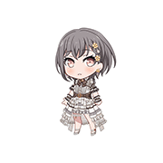
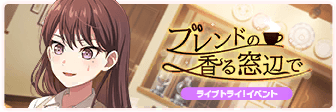
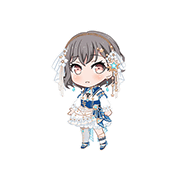
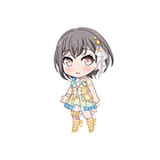
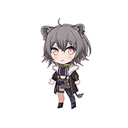

# Live2D Widget feat. MyGO!!!!!

个人自用的Live2D Widget，用于在任意网页上引入MyGO!!!!!的Live2D模型。

该仓库中所有Live2D相关资源均来自于网络，**仅供学习交流，请勿用于商业用途，如有侵权，请联系删除**。

[**点击查看示例网页**](https://live2d-widget-mygo.vercel.app/)。示例网页中模型位于左下角。

备用链接：[**点击查看示例网页**](https://live2d-widget-mygo.panxuc.com/)

## 介绍

- 本项目搭建方式参考自[nova1751/live2d-api](https://github.com/nova1751/live2d-api)。
  - 该项目搭建方式参考自[fghrsh/live2d_api](https://github.com/fghrsh/live2d_api)。
  - 该项目代码参考自[stevenjoezhang/live2d-widget](https://github.com/stevenjoezhang/live2d-widget)。
  - 该项目模型来自[Eikanya/Live2d-model](https://github.com/Eikanya/Live2d-model)，仅供学习交流，请勿用于商业用途，如有侵权，请联系删除。
- 本项目使用[PixiJS](https://github.com/pixijs/pixijs)重写了Live2D渲染部分。Live2D部分使用[pixi-live2d-display](https://github.com/guansss/pixi-live2d-display)进行渲染。
- 本项目模型来自[Bestdori](https://bestdori.com/)提供的《梦想协奏曲！少女乐团派对！》游戏数据包资源。为了适配此项目，对Live2D模型进行了一些必要的修改（根据数据包源文件为每个模型生成了`index.json`）。**仅供学习交流，请勿用于商业用途，如有侵权，请联系删除**。
- 本项目完全移除了[stevenjoezhang/live2d-widget](https://github.com/stevenjoezhang/live2d-widget)中的下头文本，为每位角色设计了单独的一套台词，大多数出自动画台词和游戏日常对话。
- 由于匹配文本和动作、表情太麻烦了，文本量还很大，所以使用[DeepSeek](https://chat.deepseek.com/)为文本匹配了动作和表情。可能会出现不灵活或者OOC的情况。

## TODO

**🚧施工中🚧**

- [x] 添加更多模型。
- [x] 添加更多文本。
- [x] 添加动作和表情。
- [ ] 修正文本和动作、表情的匹配。
- [x] 添加模型选择界面。

## 使用

只需在html页面的`head`或`body`中添加一行代码即可：

```html
<script src="https://live2d-widget-mygo.vercel.app/autoload.js"></script>
```

如果你在使用过程中遇到问题，可以尝试使用
```html
<script src="https://live2d-widget-mygo.panxuc.com/autoload.js"></script>
```
来替换上面的链接。该链接是本项目的备用链接，可能会更稳定。

即使你fork了本项目，也请填写你的js文件的绝对路径而非相对路径，以避免出现各种奇怪的问题。

### 自定义配置

默认情况下，只在浏览器宽度大于768px时显示模型，以防止模型对手机端网页阅读造成不便；模型默认显示在左下角。你也可以通过URL传递参数修改这个配置：

```html
<script src="https://live2d-widget-mygo.vercel.app/autoload.js?width_limit=0&position=right&preload=ALL"></script>
```

- `width_limit`：宽度限制，单位为像素，当浏览器宽度大于此值时显示模型，默认为768。
- `position`：模型位置，可选值为`left`和`right`，默认为`left`。
- `preload`：是否预加载模型的表情和动作，可选值为`ALL`（预加载全部表情和动作，可能导致加载新模型时网络阻塞，但动作切换较为流畅）、`IDLE`（只预加载默认表情和动作，需要时加载其他表情和动作）和`NONE`（不预加载任何表情和动作，需要时加载其他表情和动作），默认为`IDLE`。

也可以下载js和css文件来进行自定义配置，详细请参考[live2d-widget配置](https://github.com/stevenjoezhang/live2d-widget#%E9%85%8D%E7%BD%AE-configuration)。

## 模型

当前包含以下模型：

<table style="text-align: center;">
  <colgroup>
    <col style="width: auto;">
    <col style="width: 20%;">
    <col style="width: 20%;">
    <col style="width: 20%;">
    <col style="width: 20%;">
    <col style="width: 20%;">
  </colgroup>
  <thead>
    <tr>
      <th></th>
      <th><br><span lang="ja">高松 燈</span></th>
      <th><br><span lang="ja">千早 愛音</span></th>
      <th><br><span lang="ja">要 楽奈</span></th>
      <th><br><span lang="ja">長崎 そよ</span></th>
      <th><br><span lang="ja">椎名 立希</span></th>
    </tr>
  </thead>
  <tbody>
    <tr>
      <td>casual-2023</td>
      <td>春季休闲</td>
      <td>春季休闲</td>
      <td>春季休闲</td>
      <td>春季休闲</td>
      <td>春季休闲</td>
    </tr>
    <tr>
      <td>school_winter-2023</td>
      <td>冬季校服</td>
      <td>冬季校服</td>
      <td>冬季校服</td>
      <td>冬季校服</td>
      <td>冬季校服</td>
    </tr>
    <tr>
      <td>school_summer-2023</td>
      <td>夏季校服</td>
      <td>夏季校服</td>
      <td>夏季校服</td>
      <td>夏季校服</td>
      <td>夏季校服</td>
    </tr>
    <tr>
      <td>live_default</td>
      <td><br><span lang="ja">一生を、はじめよう</span></td>
      <td><br><span lang="ja">一生を、はじめよう</span></td>
      <td><br><span lang="ja">一生を、はじめよう</span></td>
      <td><br><span lang="ja">一生を、はじめよう</span></td>
      <td><br><span lang="ja">一生を、はじめよう</span></td>
    </tr>
    <tr>
      <td>live_sr_01</td>
      <td><br><span lang="ja">不思議な小動物</span></td>
      <td><br><span lang="ja">仲良くする相手は…</span></td>
      <td><br><span lang="ja">爪弾く猫</span></td>
      <td><br><span lang="ja">調停者は心静かに</span></td>
      <td><br><span lang="ja">守るのは、過去</span></td>
    </tr>
    <tr>
      <td><br>live_event_235</td>
      <td><br><span lang="ja">心の叫び</span></td>
      <td><br><span lang="ja">迷いながら</span></td>
      <td><br><span lang="ja">気の向くままに</span></td>
      <td><br><span lang="ja">終わらせてあげる</span></td>
      <td><br><span lang="ja">理想に届かない</span></td>
    </tr>
    <tr>
      <td><br>live_event_240</td>
      <td><br><span lang="ja">立希ちゃんのとなりで</span></td>
      <td><br><span lang="ja">リーダー推薦</span></td>
      <td><br><span lang="ja">コインパーキングの猫</span></td>
      <td><br><span lang="ja">肩の力を抜いて</span></td>
      <td><br><span lang="ja">私と、取引しよう</span></td>
    </tr>
    <tr>
      <td><br>live_event_250</td>
      <td><br><span lang="ja">運命の一枚</span></td>
      <td><br><span lang="ja">シックな花と</span></td>
      <td><br><span lang="ja">ひま。</span></td>
      <td><br><span lang="ja">雨はずっと</span></td>
      <td><br><span lang="ja">買い出しよりも</span></td>
    </tr>
    <tr>
      <td><br>live_event_253</td>
      <td></td>
      <td><br><span lang="ja">お花見の記念に！</span></td>
      <td></td>
      <td></td>
      <td></td>
    </tr>
    <tr>
      <td><br>live_event_277</td>
      <td></td>
      <td><br><span lang="ja">注文、いつもの</span></td>
      <td></td>
      <td></td>
      <td><br><span lang="ja">お待たせいたしました</span></td>
    </tr>
    <tr>
      <td><br>live_event_286</td>
      <td><br><span lang="ja">路地裏を抜けて</span></td>
      <td><br><span lang="ja">探しに行っちゃう？</span></td>
      <td><br><span lang="ja">あの日の縁側</span></td>
      <td><br><span lang="ja">こちらはこちらで</span></td>
      <td><br><span lang="ja">凛と立つ</span></td>
    </tr>
    <tr>
      <td><br>live_event_289</td>
      <td><br><span lang="ja">歓星の共鳴</span></td>
      <td></td>
      <td></td>
      <td><br><span lang="ja">幕開け前のひととき</span></td>
      <td></td>
    </tr>
    <tr>
      <td>birthday_2024</td>
      <td><br><span lang="ja">Hopeful birthday！</span></td>
      <td><br><span lang="ja">Hopeful birthday！</span></td>
      <td><br><span lang="ja">Hopeful birthday！</span></td>
      <td><br><span lang="ja">Hopeful birthday！</span></td>
      <td><br><span lang="ja">Hopeful birthday！</span></td>
    </tr>
    <tr>
      <td>dream_festival_3</td>
      <td><br><span lang="ja">迷い星、ひとつ</span></td>
      <td><br><span lang="ja">目覚めのあくびタイム</span></td>
      <td><br><span lang="ja">帰り道、雪舞う中で</span></td>
      <td><br><span lang="ja">この繋がりの名前は</span></td>
      <td><br><span lang="ja">カウンター越しの君</span></td>
    </tr>
    <tr>
      <td>collabo_a</td>
      <td><br><span lang="ja">見上げた視線の先は</span></td>
      <td><br><span lang="ja">その先にある輝き</span></td>
      <td><br><span lang="ja">今、この先</span></td>
      <td><br><span lang="ja">時の流れの先に</span></td>
      <td><br><span lang="ja">進む先にある答え</span></td>
    </tr>
    <tr>
      <td>collabo_d_3</td>
      <td><br><span lang="ja">のんびりダイアログ</span></td>
      <td></td>
      <td></td>
      <td></td>
      <td></td>
    </tr>
    <tr>
      <td>其他常服</td>
      <td>和服</td>
      <td></td>
      <td></td>
      <td></td>
      <td>RiNG制服、羽泽咖啡店制服</td>
    </tr>
  </tbody>
</table>
